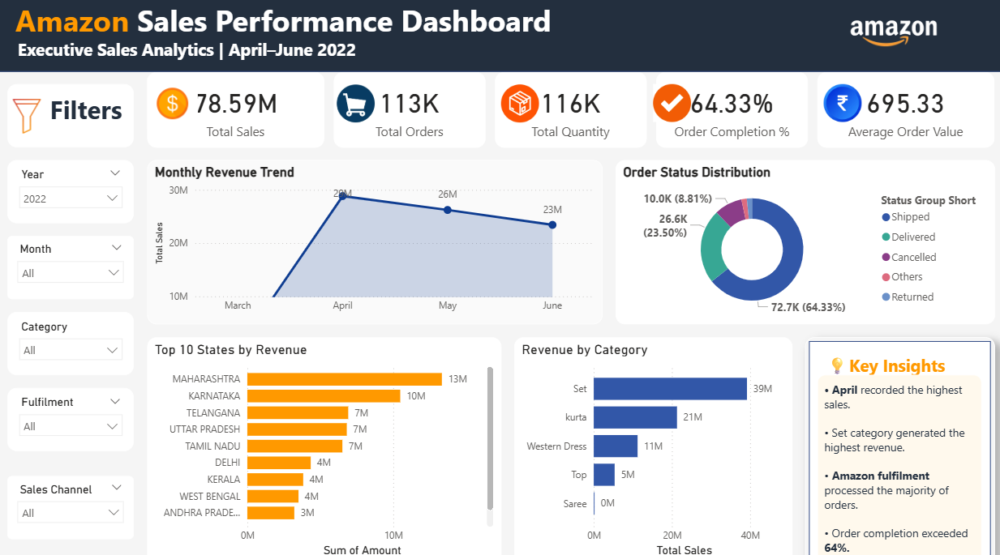

# 📊 Amazon Sales Analysis Dashboard

##  Project Overview

This project presents an interactive Power BI dashboard analyzing Amazon sales performance for April–June 2022. The dashboard provides business insights into sales trends, order status, product categories, fulfillment methods, and state-wise revenue.

---

##  Tools Used

- Power BI
- Power Query
- DAX
- Microsoft Excel

---

##  Dashboard Features

- Total Sales KPI
- Total Orders KPI
- Total Quantity KPI
- Average Order Value
- Order Completion %
- Monthly Revenue Trend
- Order Status Distribution
- Revenue by Category
- Top 10 States by Revenue
- Interactive Filters (Year, Month, Category, Fulfilment, Sales Channel)

---

##  Key Insights

- April recorded the highest monthly revenue.
- The **Set** category generated the highest sales.
- Amazon Fulfillment processed the majority of orders.
- Maharashtra contributed the highest revenue.
- Order completion exceeded 60%.

---

##  Dashboard Preview

---

##  Skills Demonstrated

- Data Cleaning using Power Query
- Data Modeling
- DAX Measures
- KPI Design
- Interactive Dashboard Development
- Business Intelligence Reporting

